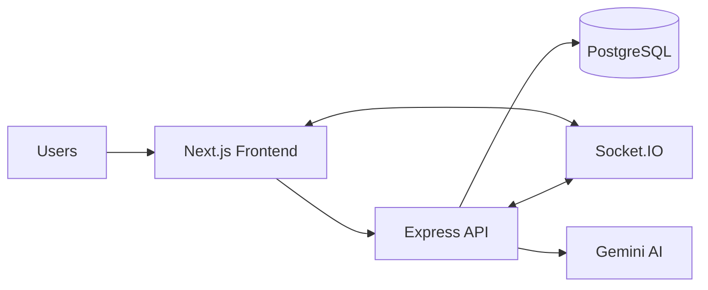
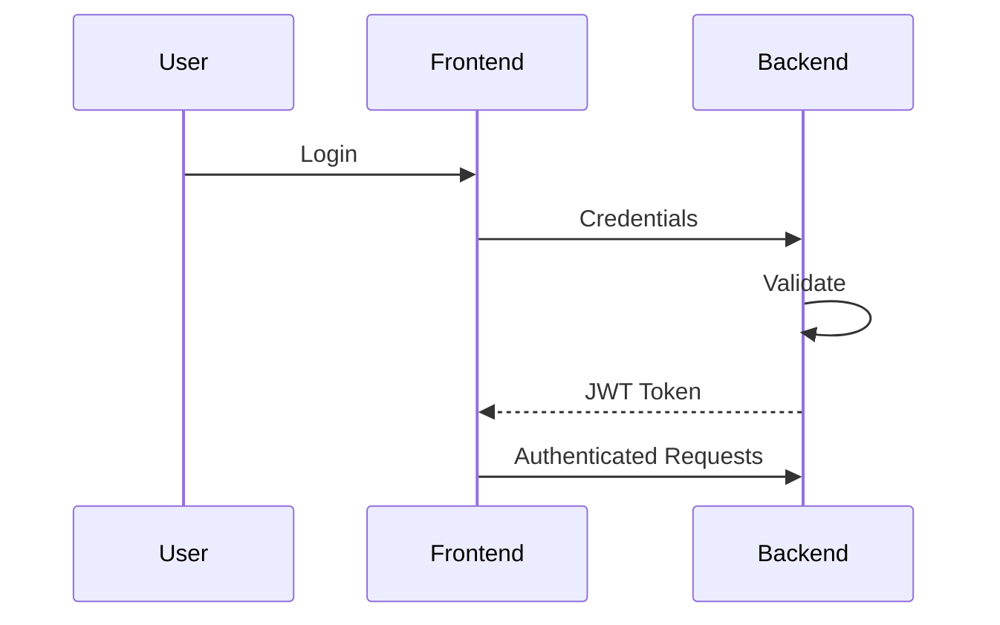
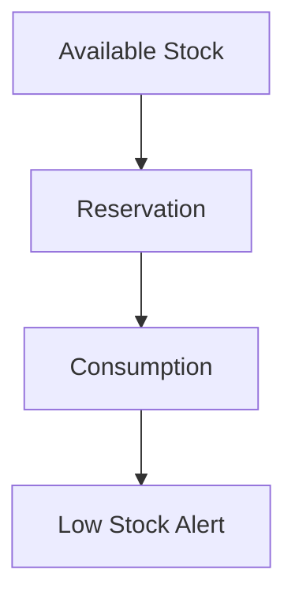

<div align="center">

# 🏭 Production Tracker

**A full-stack manufacturing operations platform — built to replace spreadsheets with a real-time, role-based workflow system.**

[](https://nextjs.org/)
[](https://react.dev/)
[](https://tailwindcss.com/)
[](https://nodejs.org/)
[](https://www.postgresql.org/)
[](https://socket.io/)
[](https://www.prisma.io/)

[🎬 Watch Demo](https://youtu.be/m-6t3C4u4Nw) · [🐛 Report Bug](https://github.com/Hamza-Znaidi/track-production---manage-stock-webapp/issues) · [✨ Request Feature](https://github.com/Hamza-Znaidi/track-production---manage-stock-webapp/issues)

</div>

---

## 📋 Table of Contents

- [✨ Features](#-features)
- [💡 Business Value](#-business-value)
- [🧱 Tech Stack](#-tech-stack)
- [🗂️ Project Architecture](#️-project-architecture)
- [🚀 Getting Started](#-getting-started)
- [⚙️ Environment Variables](#️-environment-variables)
- [📡 API Reference](#-api-reference)
- [🔐 Auth & Authorization](#-auth--authorization)
- [🔴 Realtime Events](#-realtime-events)
- [☁️ Deployment](#️-deployment)


---

## ✨ Features

| Area | Capabilities |
|------|-------------|
| 🔐 **Authentication** | JWT-based login, role-based access control (ADMIN / WORKER) |
| 👷 **Worker Sub-Roles** | SALES · CAD · CAM · STORE · CNC · ASSEMBLY · QUALITY · DELIVERY |
| 📋 **Work Orders** | Create, update, delete, monitor progress, QR code generation & lookup |
| 🔧 **Stage Management** | Role-aware task visibility, dependency enforcement, stage notes with full history |
| 📦 **Inventory** | Category-based stock management, auto-generated codes, reserve/consume/cancel workflows, low-stock alerts |
| 💬 **Realtime Chat** | Socket.IO threads, typing indicators, read receipts |
| 🔔 **Notifications** | Unread count, mark-as-read, clear — all in real time |
| 📊 **Reports** | Operational metrics + optional 🤖 Gemini AI-powered insights |

---

## 💡 Business Value

> Production Tracker helps manufacturing teams replace fragmented spreadsheets and manual follow-up with a centralized, role-based workflow system.

```
📈 Faster production flow      →  Stage-based execution with dependency enforcement
🔍 Better traceability         →  Work-order history, stage notes, QR-assisted lookup
📦 Improved inventory control  →  Reservations and low-stock alerts
⚡ Less communication lag      →  Real-time chat and notifications
📊 Better decisions            →  Analytics + optional AI-generated insights
```

---

## 🧱 Tech Stack

### 🖥️ Frontend

| Technology | Purpose |
|-----------|---------|
| ⚛️ Next.js 16 (App Router) + React 19 | UI framework |
| 🎨 Tailwind CSS v4 | Styling |
| 🔌 Socket.IO Client | Real-time updates |
| 📡 Axios | HTTP client |
| 📝 React Hook Form | Form management |
| 📈 Recharts | Charts & analytics |
| 🧾 jsPDF | PDF export |
| 📷 html5-qrcode | QR code scanning |

### ⚙️ Backend

| Technology | Purpose |
|-----------|---------|
| 🟢 Node.js + Express 4 | REST API server |
| 🗄️ Prisma ORM + PostgreSQL | Database layer |
| 🔑 JWT + bcryptjs | Auth & security |
| 📎 Multer | File uploads |
| 📱 QRCode | QR generation |
| 🔌 Socket.IO | Real-time events |
| 🤖 Gemini API | AI report insights |

---

## 🗂️ Project Architecture

```text
PFE/
└── production-tracker/
    ├── backend/
    │   ├── prisma/              # 🗃️ Schema, migrations, seed
    │   ├── src/
    │   │   ├── lib/             # 💬 Chat, notifications, reports, AI helpers
    │   │   ├── middleware/      # 🔐 JWT auth and role checks
    │   │   ├── routes/          # 📡 REST route modules
    │   │   └── server.js        # 🚀 Express + Socket.IO bootstrap
    │   └── uploads/             # 📎 Chat attachment uploads
    └── frontend/
        ├── src/
        │   ├── app/             # 📄 Admin and worker pages
        │   ├── components/      # 🧩 Reusable UI components
        │   └── lib/             # 🔧 Auth, API client, socket helpers
        └── public/
```

---

## 🏗️ System Architecture



---

## 🚀 Getting Started

### Prerequisites

Make sure you have the following installed:

-  (v20 recommended)
- 
- 

---

### Step 1 — Clone & Install

```bash
git clone https://github.com/Hamza-Znaidi/track-production---manage-stock-webapp
cd PFE

# Install backend dependencies
cd production-tracker/backend
npm install

# Install frontend dependencies
cd ../frontend
npm install
```

### Step 2 — Configure Environment Variables

Create the following files (see [⚙️ Environment Variables](#️-environment-variables) for templates):

```
production-tracker/backend/.env
production-tracker/frontend/.env.local
```

### Step 3 — Initialize the Database

```bash
cd production-tracker/backend

npm run prisma:generate   # Generate Prisma client
npm run prisma:migrate    # Run migrations
npm run seed              # Seed initial data
```

### Step 4 — Start Development Servers

**Terminal 1 — Backend:**
```bash
cd production-tracker/backend
npm run dev
```

**Terminal 2 — Frontend:**
```bash
cd production-tracker/frontend
npm run dev
```

### 🌐 Default URLs

| Service | URL |
|---------|-----|
| 🖥️ Frontend | http://localhost:3000 |
| ⚙️ Backend API | http://localhost:5000/api |
| ❤️ Health Check | http://localhost:5000/api/health |

### 🔑 Seeded Credentials

> ⚠️ **Change these immediately** outside of local development!

| Role | Username | Password |
|------|----------|----------|
| 👑 Admin | `admin` | `admin123` |
| 👷 Worker | `worker1` | `worker123` |

---

## ⚙️ Environment Variables

> 🔒 **Never commit real secrets.** Use strong, randomized values for non-local environments.

### Backend — `production-tracker/backend/.env`

```env
# 🗄️ Database
DATABASE_URL="postgresql://<db_user>:<db_password>@localhost:5432/production_tracker?schema=public"

# 🚀 Server
PORT=5000
FRONTEND_URL="http://localhost:3000"

# 🔑 Auth
JWT_SECRET="<strong_random_secret>"
JWT_EXPIRES_IN="7d"

# 🤖 AI (optional — required for AI report insights)
GEMINI_API_KEY="<your_gemini_api_key>"

# 🌐 Public URLs (optional)
PUBLIC_BASE_URL="http://localhost:5000"
BACKEND_URL="http://localhost:5000"
```

### Frontend — `production-tracker/frontend/.env.local`

```env
# 📡 API
NEXT_PUBLIC_API_URL="http://localhost:5000/api"

# 🔌 Socket (optional override)
NEXT_PUBLIC_SOCKET_URL="http://localhost:5000"
```

---

## 📡 API Reference

**Base path:** `/api`

<details>
<summary>❤️ Health</summary>

| Method | Endpoint | Description |
|--------|----------|-------------|
| `GET` | `/health` | Server health check |

</details>

<details>
<summary>🔐 Authentication & Users</summary>

| Method | Endpoint | Access |
|--------|----------|--------|
| `POST` | `/auth/login` | Public |
| `POST` | `/auth/register` | Admin only |
| `GET` | `/auth/me` | Authenticated |
| `GET` | `/auth/users` | Authenticated |
| `PUT` | `/auth/users/:id` | Admin only |
| `DELETE` | `/auth/users/:id` | Admin only |
| `GET` | `/auth/chat-users` | Authenticated |

</details>

<details>
<summary>📋 Work Orders</summary>

| Method | Endpoint | Access |
|--------|----------|--------|
| `GET` | `/workorders` | Authenticated |
| `GET` | `/workorders/:id` | Authenticated |
| `POST` | `/workorders` | Admin only |
| `PUT` | `/workorders/:id` | Admin only |
| `DELETE` | `/workorders/:id` | Admin only |
| `GET` | `/workorders/lookup/:scanValue` | Authenticated |

</details>

<details>
<summary>🔧 Stages & Notes</summary>

| Method | Endpoint | Description |
|--------|----------|-------------|
| `GET` | `/stages/my-tasks` | My active tasks |
| `GET` | `/stages/my-completed` | My completed tasks |
| `PUT` | `/stages/:id` | Update a stage |
| `GET` | `/stages/:id/notes` | Get stage notes |
| `POST` | `/stages/:id/notes` | Add a note |
| `PUT` | `/stages/:id/notes/:noteId` | Edit a note |
| `DELETE` | `/stages/:id/notes/:noteId` | Delete a note |

</details>

<details>
<summary>📦 Stock & Reservations</summary>

| Method | Endpoint | Access |
|--------|----------|--------|
| `GET` | `/stock` | Authenticated |
| `GET` | `/stock/:id` | Authenticated |
| `POST` | `/stock` | Admin only |
| `PUT` | `/stock/:id` | Admin only |
| `DELETE` | `/stock/:id` | Admin only |
| `PATCH` | `/stock/:id/quantity` | Admin only |
| `POST` | `/stock/reserve` | Authenticated |
| `GET` | `/stock/reservations` | Admin only |
| `GET` | `/stock/reservations/my-reservations` | Authenticated |
| `GET` | `/stock/reservations/work-order/:workOrderId` | Authenticated |
| `PATCH` | `/stock/reservations/:id/status` | Authenticated |

</details>

<details>
<summary>🔔 Notifications</summary>

| Method | Endpoint | Description |
|--------|----------|-------------|
| `GET` | `/notifications` | List all |
| `GET` | `/notifications/unread-count` | Unread count |
| `PATCH` | `/notifications/:id/read` | Mark as read |
| `PATCH` | `/notifications/read-all` | Mark all as read |
| `DELETE` | `/notifications/:id` | Delete one |
| `DELETE` | `/notifications` | Clear all |

</details>

<details>
<summary>💬 Chat</summary>

| Method | Endpoint | Description |
|--------|----------|-------------|
| `GET` | `/chat/threads` | List threads |
| `GET` | `/chat/:threadId` | Get thread |
| `POST` | `/chat/dm` | Start DM |
| `POST` | `/chat/workorder/:workOrderId` | Work order thread |
| `POST` | `/chat/:threadId/participants` | Add participant |
| `GET` | `/chat/:threadId/messages` | Get messages |
| `POST` | `/chat/upload` | Upload attachment |
| `POST` | `/chat/:threadId/messages` | Send message |
| `POST` | `/chat/:threadId/messages/:messageId/read` | Mark read |
| `DELETE` | `/chat/:threadId` | Delete thread (admin) |

</details>

<details>
<summary>📊 Reports</summary>

| Method | Endpoint | Access |
|--------|----------|--------|
| `POST` | `/reports/generate` | Admin only |

</details>

---

## 🔐 Auth & Authorization

```
1. 👤 User logs in via POST /api/auth/login
2. 🎟️ Backend validates credentials → returns JWT + user claims
3. 💾 Frontend stores token in localStorage
4. 📡 Every request sends: Authorization: Bearer <token>
5. 🛡️ Backend middleware validates JWT → populates user context
6. ✅ Role checks & assignment rules enforce access
7. 🔌 Socket.IO handshake also validates JWT via auth.token
```

---

## 🔐 Authentication Flow



---

## 📦 Inventory Management

### Supported Operations

- ➕ Add stock
- ✏️ Update stock
- 📉 Consume materials
- 🔒 Reserve inventory
- 🚨 Low-stock alerts



---


## 🔴 Realtime Events

### Rooms

| Room | Description |
|------|-------------|
| `thread:<threadId>` | Chat thread room |
| `workorder:<workOrderId>` | Work order room |

### Events

| Event | Description |
|-------|-------------|
| `message:new` | New chat message |
| `message:marked-read` | Message read receipt |
| `typing:user-typing` | Typing indicator start |
| `typing:user-stopped` | Typing indicator stop |
| `workorder:stage-updated` | Stage status changed |

---

## ☁️ Deployment

### Recommended Stack

| Layer | Providers |
|-------|-----------|
| 🖥️ Frontend | Vercel |
| ⚙️ Backend | Railway · Render · Fly.io |
| 🗄️ Database | Neon · Supabase · Railway · Render |

### Backend

```bash
npm install
npm run prisma:generate
npm run prisma:deploy
npm run start
```

> ⚠️ Ensure `uploads/` storage is persistent for your hosting provider.

### Frontend

```bash
npm install
npm run build
npm run start
```


<div align="center">

Made with ❤️ for modern manufacturing teams

</div>
